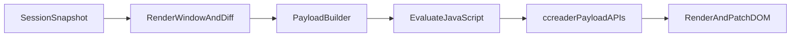

# Timeline Rendering Architecture

## Purpose

This document defines the rendering architecture boundaries for Timeline after the payload unification refactor.

## Layered Design

### 1) Snapshot and windowing (Swift)

- Source: `SessionMessagesView` builds `TimelineRenderSnapshot`.
- `TimelineHostView.Coordinator` maintains the render window (`renderedMessageRange`) and state caches:
  - `renderedMessageSet`
  - `renderedFingerprints`
  - indicator flags (`hasWaitingIndicator`, `hasOlderIndicator`)

### 2) Command and payload dispatch (Swift)

- Swift computes message-level diffs and serializes payload JSON.
- Swift calls stable JS APIs via `evaluateJavaScript()` only.
- Swift does not generate message-row HTML.

### 3) DOM rendering and patching (JS)

- `timeline-shell.js` renders rows with `ccreaderRenderMessageFromPayload(payload)`.
- All major update paths reuse payload APIs:
  - `replaceTimelineFromPayloads`
  - `prependOlderFromPayloads`
  - `replaceMessagesFromPayload`
  - `appendMessagesFromPayload`

### 4) Presentation (CSS)

- `timeline-shell.css` owns visual tokens, layout primitives, message components, and markdown typography.
- Swift does not own visual details besides localized label values passed through payload or small chrome fragments.

## Data Flow

## API Contract Surface

### Payload message contract

Required identity fields:

- `uuid`
- `domId`
- `isUser`
- `timeLabel`

Optional sections:

- `isSummary`, `thinking`, `thinkingTitle`, `modelTitle`
- `tools[]` (`title`, `body`)
- labels and legends
- `rawData`, `rawDataLabel`

### Envelope contract

- Replace timeline: `{ messages, loadOlderBarHTML, waitingHTML }`
- Prepend older: `{ messages, removeOlderBar }`

## Refactor Guardrails

- Keep `TimelineHostView` public usage unchanged.
- Any new message UI field must be added in both Swift payload builder and JS renderer.
- Avoid introducing new string-HTML transport paths for message rows.
- Keep shell API names stable unless Swift and docs are migrated together in one change.

## Regression Checklist

- Session switch re-renders correctly without full WKWebView reload.
- Load older preserves viewport position.
- Streaming updates replace only changed rows.
- Raw data copy action still works.
- External links still open through navigation delegate.
- Auto-follow bottom behavior still respects user scroll position.
